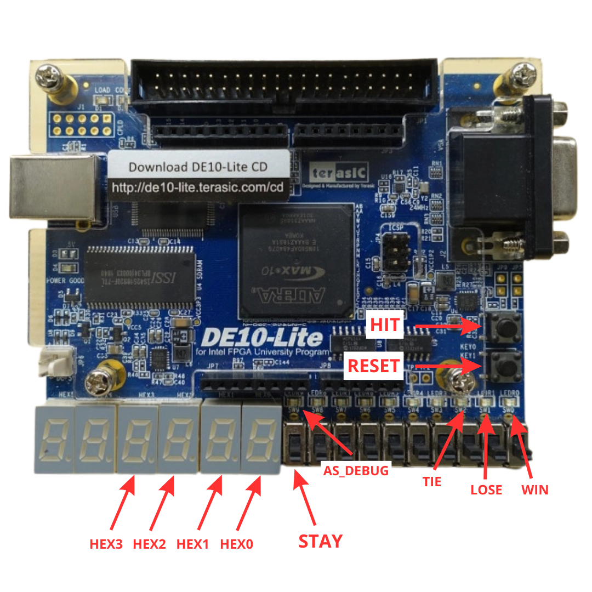
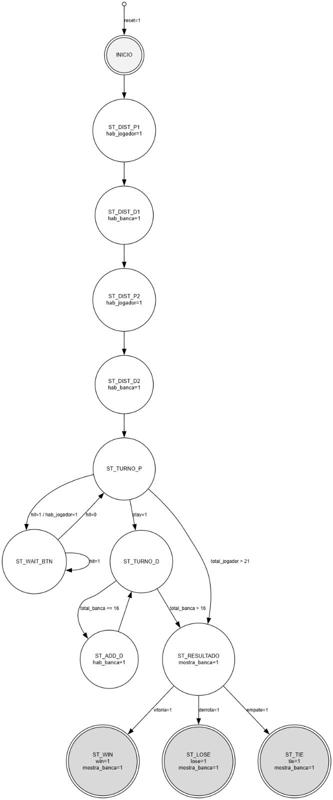
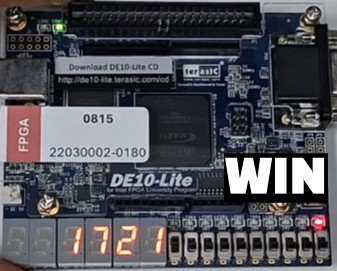
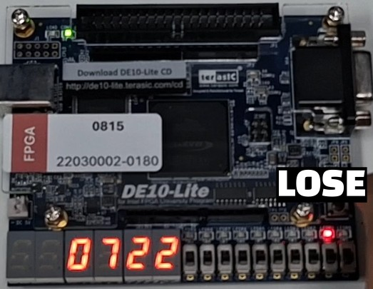
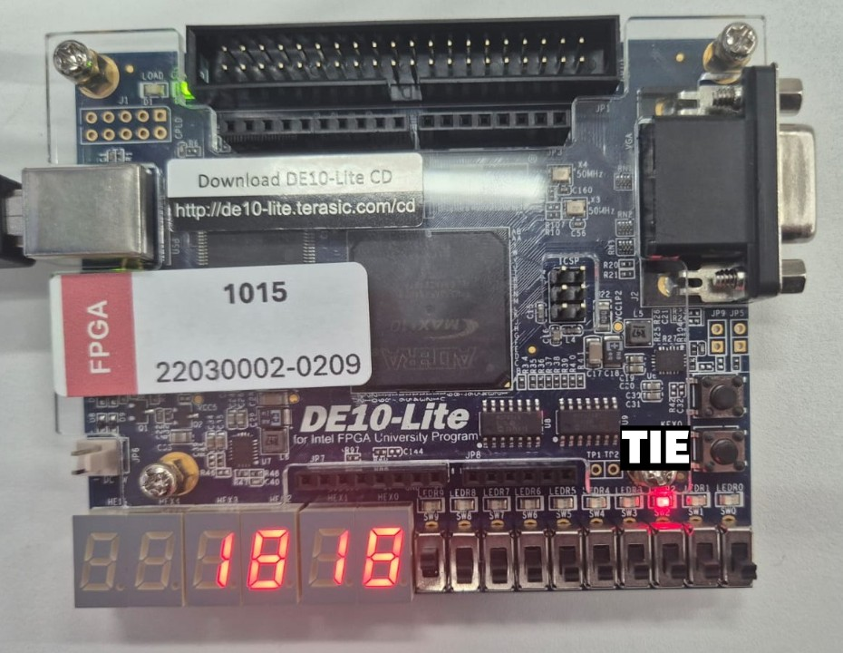

# 🃏 Blackjack em FPGA — Verilog & Máquina de Estados Finitos

> Implementação do jogo de cartas Blackjack em hardware reconfigurável utilizando Verilog HDL. O sistema é controlado por uma Máquina de Estados Finitos (FSM) síncrona e sintetizado na placa FPGA DE10-Lite da Intel/Terasic.

---

## 🏫 Informações Acadêmicas

| | |
|---|---|
| **Instituição** | Universidade Federal do Amazonas (UFAM) |
| **Faculdade** | Faculdade de Engenharia Elétrica e de Computação (FEEC) |
| **Disciplina** | Eletrônica Digital II e Laboratório de Eletrônica Digital |
| **Professor** | Prof. Dr. Thiago Brito |
| **Ano** | 2026 |

**Equipe:**
- João Pedro Felipe Dantas
- Larissa Rafaela Ribeiro de Souza
- Paulo Lucas Tarola Moreira

---

## 📋 Sobre o Projeto

O sistema implementa um jogo de Blackjack completo entre um jogador e uma banca automática. O objetivo é acumular uma pontuação superior à da banca sem ultrapassar 21 pontos. A lógica do jogo é controlada por uma FSM síncrona de 13 estados, com distribuição pseudoaleatória de cartas via LFSR de 6 bits, interface com botões e displays de 7 segmentos da DE10-Lite.

---

## 🎮 Como Jogar

| Controle | Componente | Função |
|---|---|---|
| **HIT** | KEY[0] | Pedir uma nova carta |
| **STAY** | SW[9] | Encerrar o turno |
| **RESET** | KEY[1] | Iniciar nova partida |

**Saídas:**
- **HEX1/HEX0** — Pontuação do jogador (sempre visível)
- **HEX3/HEX2** — Pontuação da banca (visível apenas ao final)
- **LEDR[0]** — Vitória (WIN)
- **LEDR[1]** — Derrota (LOSE)
- **LEDR[2]** — Empate (TIE)
- **LEDR[9]** — Indica quando um Ás foi processado



---

## 🏗️ Arquitetura do Sistema

O projeto foi estruturado de forma modular e hierárquica, com separação clara entre lógica sequencial e combinacional. A arquitetura é dividida em quatro camadas principais:

- **Controle (FSM)** — coordena o fluxo completo do jogo por meio de uma máquina de estados síncrona de 13 estados
- **Caminho de dados (Datapath)** — gerencia o acúmulo de pontuações, o tratamento automático do Ás e a detecção de estouro
- **Memória e aleatoriedade** — ROM de 52 cartas com travessia pseudoaleatória via LFSR de 6 bits
- **Interface e saída** — decodificação para os displays de 7 segmentos, tratamento de bounce dos botões e mapeamento físico dos pinos da DE10-Lite

---

## 🔄 Máquina de Estados Finitos

A FSM possui 13 estados organizados em quatro fases: distribuição inicial, turno do jogador, turno automático da banca e apresentação do resultado.



---

## 🎲 Aleatoriedade com LFSR

Para simular um baralho embaralhado, o módulo `Contador_baralho` implementa um LFSR de 6 bits com polinômio x⁶ + x + 1, gerando um ciclo de 63 estados sem repetição. Os 11 estados inválidos (53–63) são pulados via *unrolling* combinacional de até 5 passos. A semente é capturada no momento em que o jogador solta o botão de reset, garantindo variação entre partidas.

---

## ✅ Resultados em Hardware

Os três estados terminais foram validados fisicamente na placa DE10-Lite:

| Vitória (17 vs 21) | Derrota (07 vs 22) | Empate (18 vs 18) |
|:---:|:---:|:---:|
|  |  |  |

---

## 📊 Ocupação de Recursos (Síntese — MAX 10)

| Recurso | Utilizado |
|---|---|
| Elementos lógicos | 258 (< 1% do chip) |
| Registradores | 87 |
| Pinos de I/O | 51 |

---

## 🗂️ Estrutura do Repositório

```
📁 blackjack/
├── 📁 blackjack-verilog/
├── 📁 imagens/
└── README.md
```

## 🛠️ Ferramentas Utilizadas


